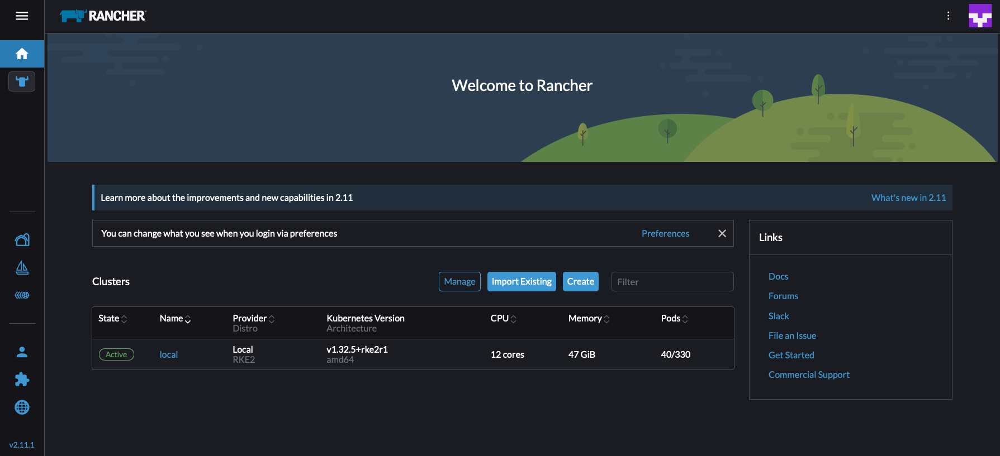
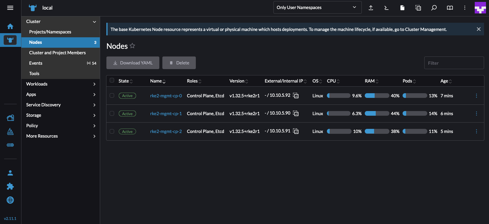

# Howto RKE2 with Helm

I'm going to keep this very lean for now and expand later as more questions pop up from its use. The helmchart itself is packaged in a tarball for your ease of downloading: [rke2-cluster-0.1.2.tgz](./rke2-cluster-0.1.2.tgz) but if you wish to modify the chart or commit changes, it is also exposed in the [rke2-cluster directory](./rke2-cluster/).

The intention of this helmchart is to create an RKE2 cluster within Harvester without the use of complex scripting or other CD tools like Ansible or Terraofrm. This makes use of Harvester's Kubevirt-based CRDs as well as the Kubevip LoadBalancer. In this configuration, it also adds `HelmChart` CRDs to auto-install additional components into the cluster. These are generic yaml constructs, so really any K8S-friendly resource can be added. This makes it very flexible.

This helmchart also enforces affinity rules per VM. So no RKE2 node will share a host with another. In order to achieve an HA deployment, you just need at least 3 harvester nodes. Otherwise it will just be one.

It can build a community/cloud-sourced install as well as Prime or Carbide versions as well as handling airgapped installations, its just a matter of ensuring the configs are correct.

Provided here is an example of a [community install for dhcp](examples/community-install.yaml), and a [community install for static ips](examples/community-install-staticip.yaml)

You will want to adjust these values to suit your environment.

## Known Bugs

Due to what was a limitation in Harvester 1.3 handling Load Balancers and Helm's notorious issues with order of creation, there was a bug in place when removing the helm chart. It requires calling 'delete' twice because it will fail to delete the IPPool since the LoadBalancer is still attached to it.

Now that the Harvester limitation was resolved in 1.5, we should be able to handle this case more elegantly with a Helm annotation, but that is not currently in place.

## Install

*NOTE* You definitely want to create a configuration to use for this helm chart. Follow the [instructions](#configuration)

Assuming your config is located in `values.yaml`, you can install the helmchart easily as any other helm package. Ensure your kubecontext is pointed at your Harvester cluster.

```bash
helm upgrade -i rke2-mgmt rke2-cluster-0.1.2.tgz -f values.yaml
```

## Configuration

Analyzing the values file [here](examples/community-install.yaml), there are several config items we need to set to tailor to our environment.

### Cluster Config
At the top are cluster is the cluster details.

* The network name is key here. Ensure this is a NAD within your Harvester environment (if you're using formal Harvester networking, this is a `VM Network`). These are where the VMs will go
* Next is the RKE2 version, this must include the `+` notation.
* Add your ssh pub key here for proper debug sessions

```yaml
cluster_name: rke2-mgmt
network_name: services
network_namespace: default
rke2_version: "v1.32.5+rke2r1"
ssh_pub_key: <key>
```

### VM Config

Here is where we configure the nature of the VM we will use as a base image. If I do not have airgap configuration (which requires the tarball to be in a specific location on a prebuilt VM image), I want that set to false. The qemu_agent settings are obvious, my slem image already has it installed but not activated.

My VM image name is the actual true name of the VM image. If you uploaded your image manually via the UI, it will not look like my example. It will be named `image-xyz123` or similar. Unfortunately, to this day, some aspects of the Rancher backend, Longhorn in this case, still leverage generative names even though they make automation more difficult. If you create your VM image from a `kubectl` command, you can control the name of it directly.

Use this command to print a mapping of your virtualmachineimage names vs displaynames:
```bash
kubectl get virtualmachineimage -o jsonpath='{range .items[*]}{.metadata.name}{" => "}{.spec.displayName}{"\n"}{end}'
```

```yaml
vm:
  airgapped_image: false
  arch: amd64
  image: slem-6.1
  qemu_agent_enable: true
  qemu_agent_install: true
```

### Control Plane Config

Next we set our control plane configuration, here we choose the VM spec itself along with networking details:

* The `vip` value is the Load Balancer IP for your cluster that Harvester will create. As of 1.5, this MUST be on the same subnet/cidr range as your Harvester host nodes. Currently, load balancing in this chart does not support dhcp
* The loadbalancer gateway is the same gateway your Harvester host nodes are using, as is the subnet definition
```yaml
control_plane:
  node_count: 3
  cpu_count: 4
  vip: 10.10.0.5
  loadbalancer_gateway: 10.10.0.1
  loadbalancer_subnet: 10.10.0.0/24
  memory_gb: 16
```

Within `files` we can see the `HelmChart` objects. Eventually, these will be auto-rendered by Helm, but for now we have to manually edit them since they are strings. The most notable items are the Rancher version you want and any other config items. Here we are using the cert-manager auto-signed TLS cert but its very easy to do certs a different way (such as managing the secret directly).

Ensure you are setting your Rancher replicas to match your Harvester node count and ensure you set your domain name appropriately.

```yaml
  files:
  - content: |
      apiVersion: helm.cattle.io/v1
      kind: HelmChart
      metadata:
        name: cert-manager
        namespace: default
      spec:
        bootstrap: false
        targetNamespace: cert-manager
        createNamespace: true
        set:
          crds.keep: "true"
          crds.enabled: "true"
          ingress.tls.source: rancher
        chart: cert-manager
        repo: https://charts.jetstack.io
        version: 1.17.2
    owner: root
    path: /var/lib/rancher/rke2/server/manifests/certmanager.yaml
  - content: |
      apiVersion: helm.cattle.io/v1
      kind: HelmChart
      metadata:
        name: rancher
        namespace: default
      spec:
        bootstrap: false
        targetNamespace: cattle-system
        createNamespace: true
        set:
          hostname: rancher.mydomainname.com
          replicas: 3
          bootstrapPassword: admin
          ingress.tls.source: rancher
        chart: rancher
        repo: https://releases.rancher.com/server-charts/stable
        version: 2.11.1
    owner: root
    path: /var/lib/rancher/rke2/server/manifests/rancher.yaml
```

Finally we have the ipam configuration and runcmd field. Below we see the dhcp configuration. The runcmd field has commands designed for SLE Micro 6.1 in order to disable firewalld. If you're using a different VM image, you may not need these but you might need a different command.

```yaml
  ipam: dhcp
  runcmd:
  - systemctl stop firewalld
  - systemctl disable firewalld
  - systemctl mask firewalld
  network: []
```

Here's a static ip example snippet located in the [static-ip example](examples/community-install-staticip.yaml). Note that these are just cloud-init values for the network data. Eventually this will also be auto-generated by using a pool of IPs instead. For now it is manual. Note the device name in `ethernets` is `eth0`. This works for SLE Micro 6.1 but VMs like `Ubuntu` will likely be `enp1s0`. The remaining values should be obvious, but ensure these IPs and gateway are tied to whatever network was chosen for the VMs to mount to. In my example, `services` is on VLAN 5 and has a CIDR range of `10.10.5.0/24`.

```yaml
  network:
  - |
    network:
      version: 2
      ethernets:
        eth0:
          dhcp4: false
          addresses: [ "10.10.5.21/24" ]
          gateway4: 10.10.5.1
          nameservers:
            addresses:
            - 10.10.0.1
  - |
    network:
      version: 2
      ethernets:
...
  - |
    network:
      version: 2
      ethernets:
...
```

# Example Install


```console
$ helm upgrade -i rke2-mgmt rke2-cluster-0.1.2.tgz -f values.yaml
Release "rke2-mgmt" does not exist. Installing it now.
NAME: rke2-mgmt
LAST DEPLOYED: Mon Aug 11 13:47:09 2025
NAMESPACE: default
STATUS: deployed
REVISION: 1
TEST SUITE: None
```

I give the helmchart controller a minute to kick things off and then I inspect my VM Instances using the vm-group annotation with my chosen cluster name (by default is `rke2-mgmt`):
```console
$ kubectl get vmi -l vm-group=rke2-mgmt
NAME             AGE   PHASE     IP           NODENAME          READY
rke2-mgmt-cp-0   73s   Running   10.10.5.92   harvester-rprtg   True
rke2-mgmt-cp-1   73s   Running   10.10.5.90   harvester-fkf98   True
rke2-mgmt-cp-2   73s   Running   10.10.5.91   harvester-ffjvv   True
```

I can determine when my cluster is online by viewing the Load Balancer health via kubectl (or via the UI):
```bash
[[ $(kubectl get loadbalancer rke2-mgmt-lb -o jsonpath='{.status.conditions[].status}') == "True" ]] && echo "RKE2 is UP" || echo "RKE2 is DOWN"
```

```console
$ [[ $(kubectl get loadbalancer rke2-mgmt-lb -o jsonpath='{.status.conditions[].status}') == "True" ]] && echo "RKE2 is UP" || echo "RKE2 is DOWN"
RKE2 is UP
```

When Rancher is online, it will be available at the URL specified. If you used a dummy url, ensure your local `/etc/hosts` points at the load balancer IP that you chose. Assuming a normal download speed, it takes about 5-6 min for Rancher to install and become available.

If you are impatient, you can SSH into one of the nodes using your SSH key and peek at the current cluster status (ensure your ssh user is correct):
```console
$ ssh -i ~/.ssh/infrakey sles@10.10.5.92 -C 'sudo /var/lib/rancher/rke2/bin/kubectl --kubeconfig /etc/rancher/rke2/rke2.yaml get po -n cert-manager -n cattle-system'
NAME                       READY   STATUS              RESTARTS   AGE
rancher-769fb44ccf-4h5xl   0/1     ContainerCreating   0          33s
rancher-769fb44ccf-sdqfm   0/1     ContainerCreating   0          33s
rancher-769fb44ccf-zrct2   0/1     ContainerCreating   0          33s
```

Here's my console, which took about 6min to become available from the time I kicked off the helm process:



And I'm in the local cluster inspecting the nodes here to see my available cluster:




## Conclusion

Using this pattern, I can eliminate usage of Terraform and Ansible or any other CD tools other than kubernetes-native tools (ie. Helm). The 'scripting' here is reduced drastically yet still exposes immense flexibility via the cloud-init configuration to do customized steps within my cluster without requiring SSH access at all. If I wanted, I could wrap this helmchart into a `HelmChart` crd of its own and bypass the need for the Helm cli.